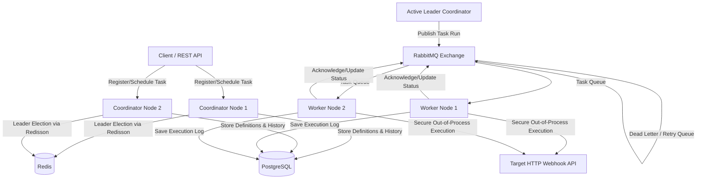

# Distributed Task Orchestrator & Scheduler (Enterprise Edition)

This document outlines the architecture, database schema, queue topology, deployment strategy, and implementation details for a highly scalable, fault-tolerant, and secure Distributed Task Scheduler.

Based on feedback, the system will use **Redis** for distributed locking/coordination, **RabbitMQ** for task queuing, and support **exponential backoff retries** and **secure execution via HTTP webhooks**.

---

## Enterprise Architecture Overview



### Core Architecture Components

1. **Distributed Coordination (Redis & Redisson)**:
   - Coordinators run in an Active-Standby configuration.
   - Leader election is performed using a Redisson distributed lock (`RLock`) with a lease time. If the leader fails to renew the lease, a standby coordinator takes over.
2. **Message Broker (RabbitMQ)**:
   - Decouples task scheduling from task execution.
   - Handles task dispatching, load balancing across workers, and message acknowledgments.
   - Supports **Exponential Backoff** using RabbitMQ Dead Letter Exchanges (DLX) and message Time-To-Live (TTL).
3. **Relational Storage (PostgreSQL)**:
   - Stores durable task schedules (cron expressions), metadata, and historical execution logs.
4. **Coordinator Node**:
   - Manages CRUD of task schedules.
   - Runs the scheduling engine (polling database schedules).
   - Enqueues tasks into RabbitMQ when they are due.
5. **Worker Node**:
   - Consumer of RabbitMQ queues.
   - Executes tasks in virtual threads (Java 21).
   - Executes tasks securely by dispatching them to external target APIs (Webhooks) with authentication, request signing, and timeout configurations.

---

## Proposed Technical Design

### 1. Database Schema (PostgreSQL)

```sql
-- Store task definitions and schedule info
CREATE TABLE task_schedules (
    id VARCHAR(36) PRIMARY KEY,
    name VARCHAR(255) NOT NULL,
    cron_expression VARCHAR(100) NOT NULL,
    webhook_url TEXT NOT NULL,
    headers JSONB, -- Auth headers, etc.
    max_retries INT DEFAULT 3,
    backoff_multiplier DOUBLE PRECISION DEFAULT 2.0,
    initial_interval_sec INT DEFAULT 5,
    status VARCHAR(50) DEFAULT 'ACTIVE',
    created_at TIMESTAMP WITH TIME ZONE DEFAULT CURRENT_TIMESTAMP,
    updated_at TIMESTAMP WITH TIME ZONE DEFAULT CURRENT_TIMESTAMP
);

-- Store task execution history
CREATE TABLE task_executions (
    id VARCHAR(36) PRIMARY KEY,
    task_schedule_id VARCHAR(36) REFERENCES task_schedules(id) ON DELETE CASCADE,
    status VARCHAR(50) NOT NULL, -- RUNNING, SUCCESS, FAILED, RETRYING
    attempt INT NOT NULL,
    error_message TEXT,
    started_at TIMESTAMP WITH TIME ZONE NOT NULL,
    completed_at TIMESTAMP WITH TIME ZONE,
    response_status INT
);
```

### 2. RabbitMQ Topology & Retry Strategy
To achieve scalable, resilient, and enterprise-grade task delivery, we will use a **Retry Exchange Pattern**:

*   **`task.direct` (Exchange)**: Routes incoming task requests to `task.queue`.
*   **`task.queue`**: Workers consume from this queue. If execution fails, the worker rejects the message without re-queuing, and it gets automatically routed to a Dead Letter Exchange.
*   **`task.retry.exchange`**: Configured as the DLX for `task.queue`. It routes to dynamic retry queues or a generic wait queue.
*   **`task.retry.wait`**: A queue with a TTL (e.g., 5s, 10s, 20s based on exponential backoff). Once the TTL expires, the message is routed back to `task.direct` for execution.

---

## Deployment Plan

### 1. Local Development Deployment (Docker Compose)
For local development and testing, we will write a `docker-compose.yml` to spin up PostgreSQL, Redis, and RabbitMQ:

```yaml
version: '3.8'

services:
  postgres:
    image: postgres:15-alpine
    container_name: orchestrator-postgres
    environment:
      POSTGRES_DB: scheduler
      POSTGRES_USER: user
      POSTGRES_PASSWORD: password
    ports:
      - "5432:5432"
    volumes:
      - pgdata:/var/lib/postgresql/data

  redis:
    image: redis:7-alpine
    container_name: orchestrator-redis
    ports:
      - "6379:6379"

  rabbitmq:
    image: rabbitmq:3.12-management-alpine
    container_name: orchestrator-rabbitmq
    ports:
      - "5672:5672"
      - "15672:15672" # Management UI
    environment:
      RABBITMQ_DEFAULT_USER: guest
      RABBITMQ_DEFAULT_PASS: guest

volumes:
  pgdata:
```

### 2. Production Deployment (Kubernetes)
In a production cloud environment (e.g., AWS EKS, GCP GKE), we will structure the deployment as follows:

*   **Managed Services (Recommended)**:
    *   Use a managed PostgreSQL service (e.g., AWS RDS, GCP Cloud SQL) for schedule storage.
    *   Use a managed Redis cluster (e.g., AWS ElastiCache, GCP Cloud Memorystore) for leader election.
    *   Use a managed RabbitMQ (e.g., CloudAMQP) or set up a clustered stateful set in K8s.
*   **Stateless Coordinators**:
    *   Deployed as a Kubernetes `Deployment` with `replicas: 2`.
    *   Health checks (`/actuator/health` or similar check) set up for liveness and readiness probes.
*   **Stateless Workers**:
    *   Deployed as a Kubernetes `Deployment` with `replicas: 3` (or more based on workload).
    *   Configure Horizontal Pod Autoscaler (HPA) to scale worker pods dynamically based on CPU/Memory or RabbitMQ queue length (using custom Prometheus metrics).
*   **ConfigMaps & Secrets**:
    *   Manage database passwords, RabbitMQ credentials, and webhook signing secret keys securely using K8s Secrets or AWS Secrets Manager / GCP Secret Manager.

---

## Proposed Project Structure

We will create a multi-module Maven project in:
`C:\Users\User\.gemini\antigravity\scratch\distributed-scheduler`

```
distributed-scheduler/
├── pom.xml
├── orchestrator-common/          (Protobuf, model interfaces, shared configurations)
├── orchestrator-coordinator/     (Spring Boot app for scheduling, API, leader election)
└── orchestrator-worker/          (Lightweight spring-boot consumer app for task execution)
```

---

## Verification Plan

### Automated Tests
- **Integration Tests**: Using Testcontainers to spin up real PostgreSQL, Redis, and RabbitMQ instances.
- **Failover Tests**: Simulating leader process crashes to confirm another coordinator claims the lock and resumes scheduling.
- **Retry Tests**: Publishing a failing task and checking that RabbitMQ delays and retries it up to `max_retries` with exponential backoff.

### Manual Verification
1. Run local Docker Compose with Redis, RabbitMQ, PostgreSQL.
2. Spin up two instances of the Coordinator. Inspect logs to see lock acquisition.
3. Stop Coordinator 1; check that Coordinator 2 grabs the lock.
4. Verify task execution success, retry logs, and failure dead-lettering.
